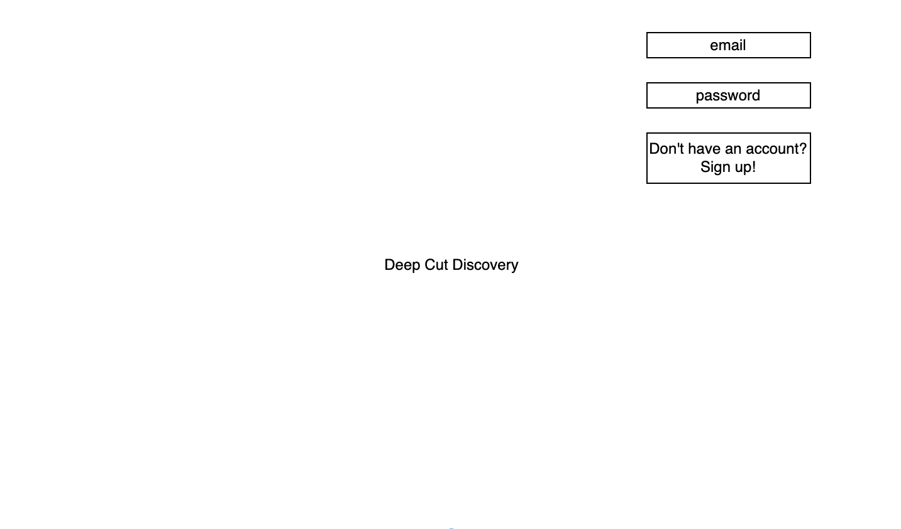
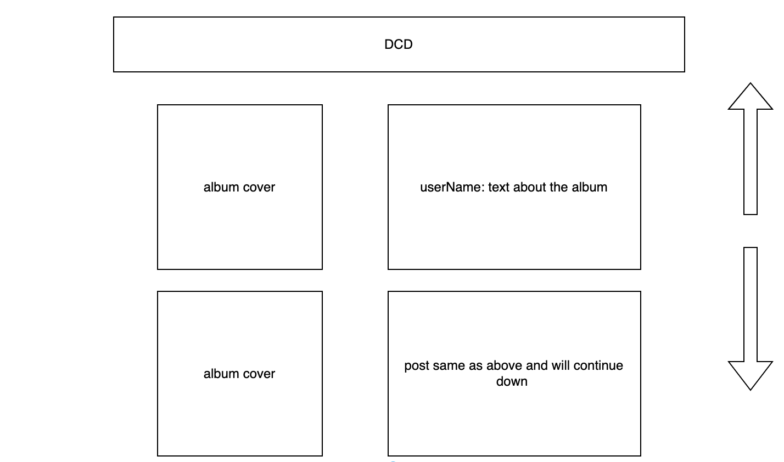
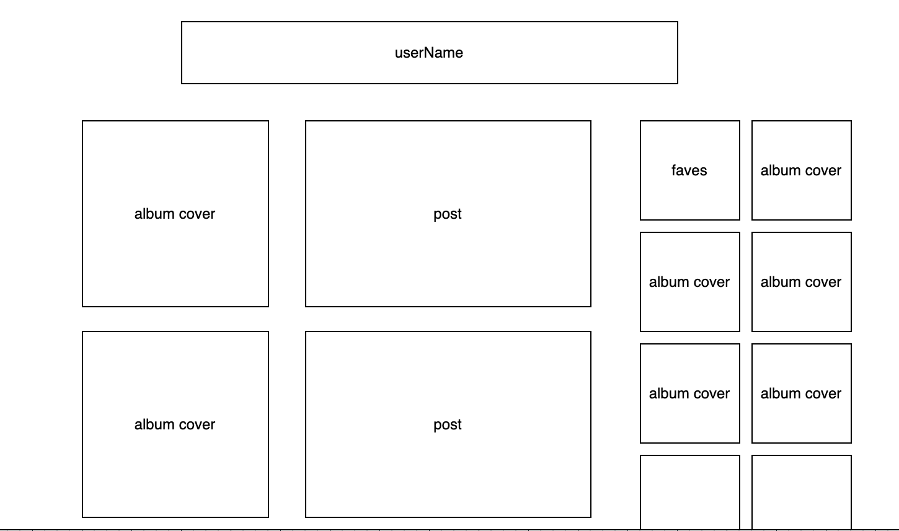
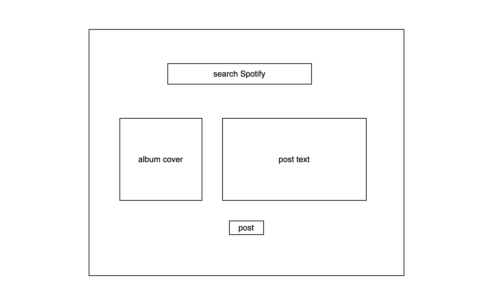
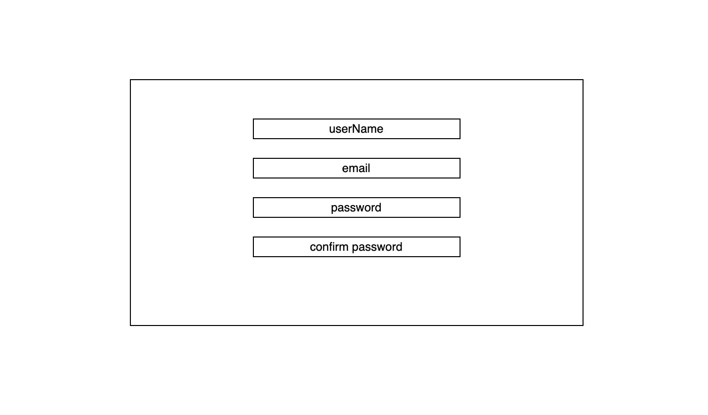
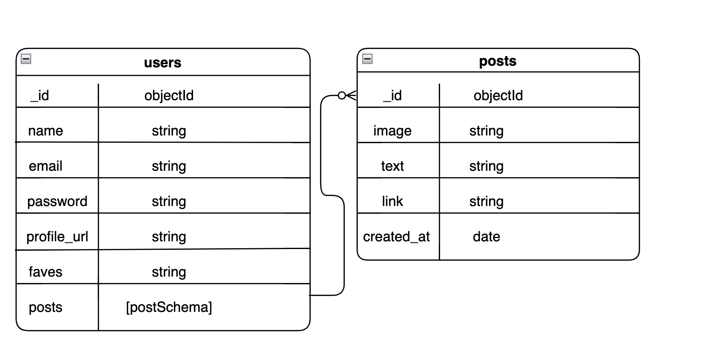

# Deep Cut Discovery

Deep Cut Discovery is a MERN stack application. Link to server repository

# What it is

Deep Cut Discovery is a social music blog where music listeners can share their new discoveries with other like minded users. If a user happens to like another user's post and wants to more about that user, they can visit that user's profile page and see the user's past posts to see if they can find more music to checkout. This app will use the Discogs API. The user will be able to search for the song or album that would like to share, and then post the album cover to a social media style feed with a little bit of writting below the artwork. Users will be able to favorite albums or songs and the same artwork that will show u on the feed for other users to see so they get a feel for that user's taste.

# Screenshot

# Technologies used

The technologies used to create this app were MongoDB, Mongoose, Express, React.js, Node.js, HTML, Sass, Postman and the Spotify API.

# Installation instructions -- client

1. Fork and clone repo
2. Install repo onto local client
3. `npm i` to install all dependencies
4. Create a .env.local file inside the root directory of the project
5. Inside the .env.local file type `REACT_APP_SERVER_URL=http://127.0.0.1:<portOfYourChoosing>`
6. npm start

<summary>Dependencies</summary>
1. axios
2. jsonwebtoken
3. react-router-dom
4. jwt-decode

# Installation instructions -- server

1. Fork and clone server repo (at the top of the page)
2. Install repo onto local client
3. `npm i` to install all dependencies
4. Create a .env file inside the root directory of the project
5. Inside the .env file add

```
 PORT=<portUsedInFrontEnd>
 MONGODB_URI=mongodb://127.0.0.1/<dataBaseNameOfYourChoosing>
 JWT_SECRET='<StringOfYourChoosing>'
 SPOTIFY_URL=https://api.spotify.com/v1
```

# RESTful Routing Chart - server

| **CRUD** | **URL**                | **DESCRIPTION**                                   |
| -------- | ---------------------- | ------------------------------------------------- |
| POST     | /api-v1/users/register | Adds a new user to database                       |
| POST     | /api-v1/users/login    | Logs in the user, sends back a token              |
| GET      | /api-v1/users          | Reads all user documents with posts               |
| GET      | /api-v1/users/:id      | Reading user document corresponding to ID         |
| PUT      | /api-v1/users/:id      | Updates user document with profile pic            |
| DELETE   | /api-v1/users/:id      | Deletes user document corresponding to ID         |
| GET      | /api-v1/posts          | Get posts subdocs in current user document        |
| POST     | /api-v1/posts          | Creates post subdoc in current user document      |
| PUT      | /api-v1/posts/:id      | Updates picture caption corresponding to ID       |
| DELETE   | /api-v1/posts/:id      | Delete individul picture post corresponding to ID |
| POST     | /api-v1/faves          | Saves a favorite to user ID                       |
| DELETE   | /api-v1/faves/:id      | deletes a favorite from user ID                   |

# Restful Routing Chart - front-end

| **CRUD** | **URL**       | **DESCRIPTION**                                                  |
| -------- | ------------- | ---------------------------------------------------------------- |
| GET      | /             | Renders a landing page with login form or sign up link           |
| GET      | /register     | Renders a register form for new users to create an account       |
| GET      | /home         | Renders a page with a feed of all user posts artwork and words   |
| GET      | /profiles/:id | Renders specific user with all corresponding posts and fovorites |
| GET      | /search       | allows you to search Spotify select some music and create a post |

# Wireframes











# ERD



# User Stories

- As a user without an account, I would like to register with my name, email, and password.
- As a user who finished registration, I would like to be able to sign into my created account.
- As a user who is signed in, I would like to be able to sign out of my account.
- As a user I want to post albums or songs to the site, so I can share what I've discovered
- As a user I would like to edit any post I have already made.
- As a user I would like to delete any post I have already made.
- As a user I want to be the only one who can edit or delete my post.
- As a user I want to click on others profiles, so I can see the posts they've made or records they favorited.
- As a user I want to click on an post of another user to see more information.
  -As a user I want to be able to favorite the music from someone else's post to add to my page.

# MVP goals

- Sign up and sign in functionality.
- User authentication with encrpyted passwords.
- CRUD functionality for a users post
- User authorization for post update and delete.
- Layout for signed in user home page showing all users with a feed of all of the posts.
- Profile page which shows all of the users posts as well as other records they've favorited.

# Stretch goals

- Make this look really good using only Sass
- add comments to the posts from other users
- super stretch hide users who post bad songs/curating your own feed

# Sprint goals

- Tuesday make sure the API is working with the page and having most of the backend complete
- Wednesday having all of the backend complete and all of the functionality of the front end.
- Thursday MVP
